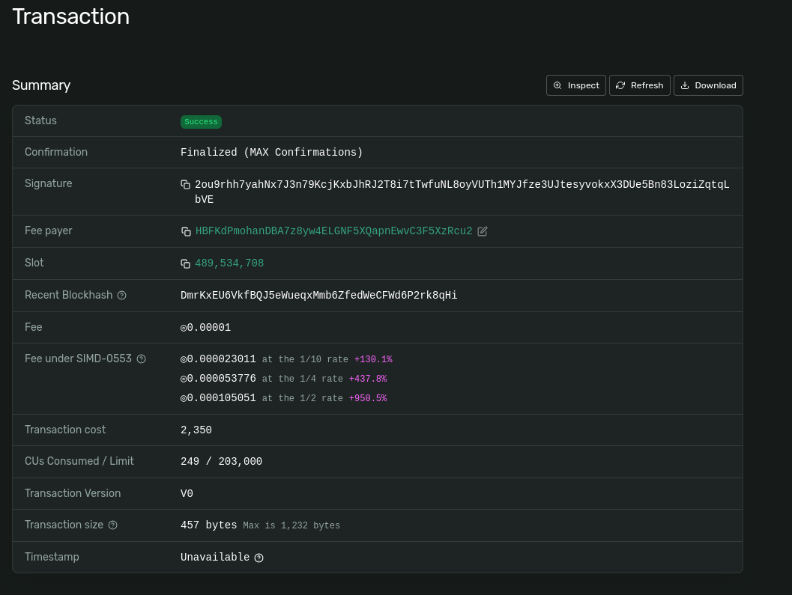
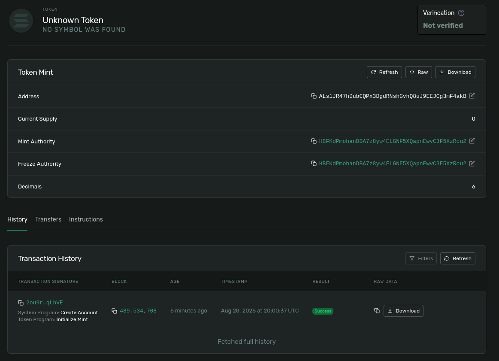
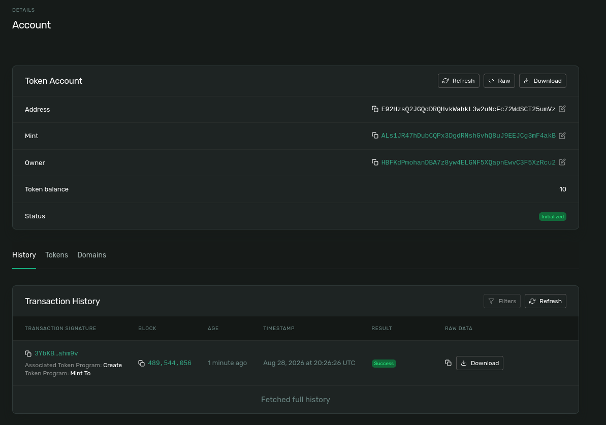
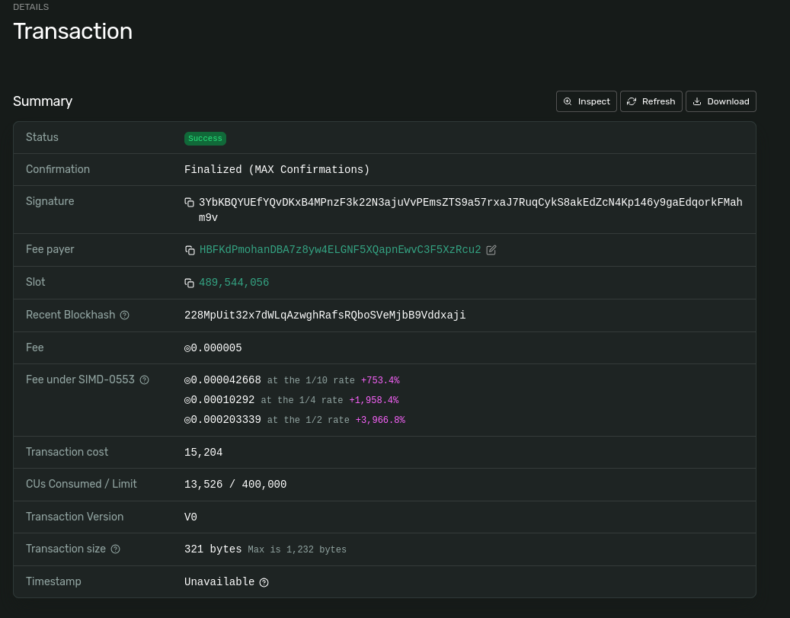
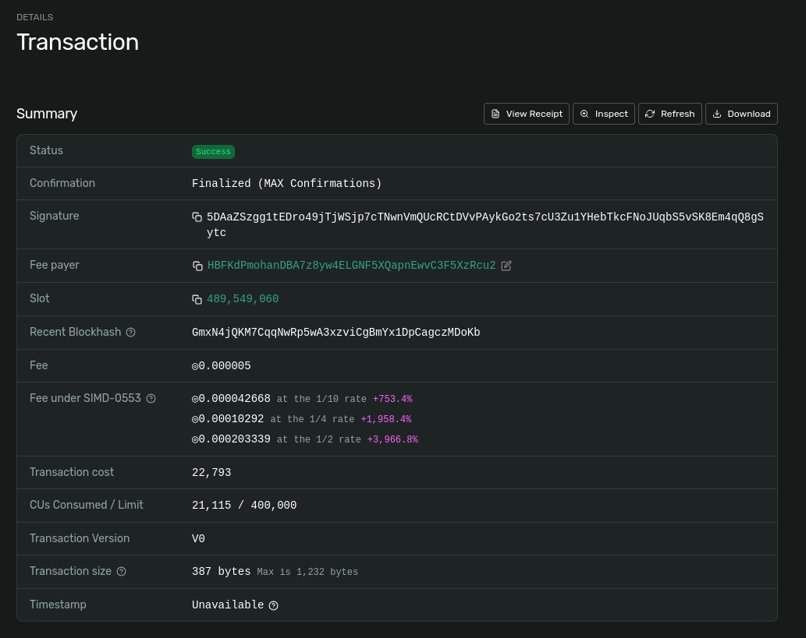
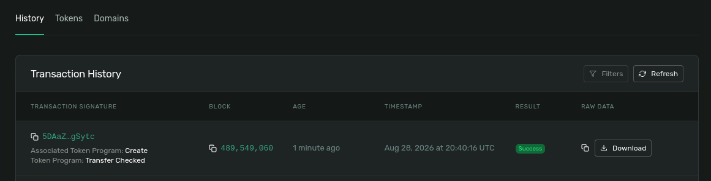
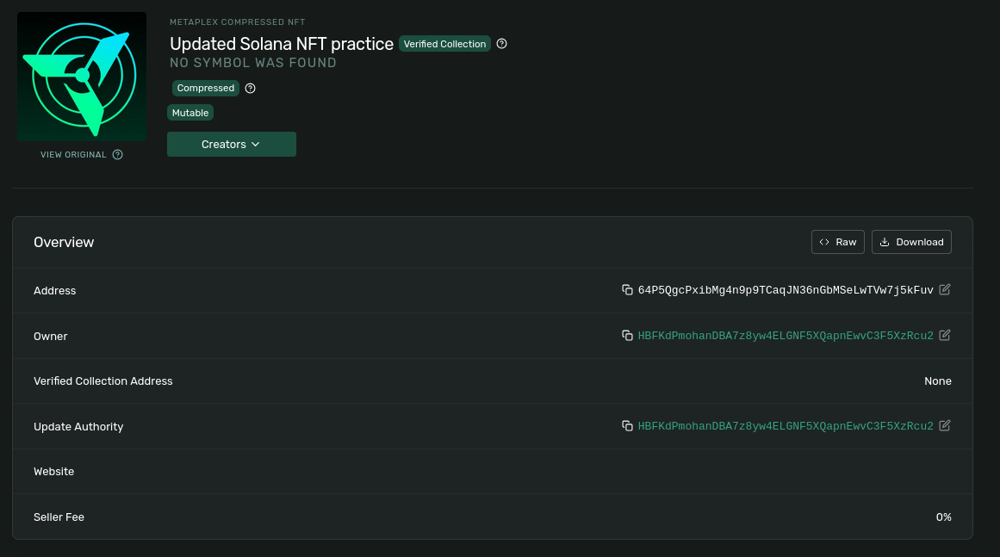
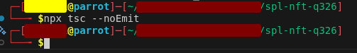

# Solana SPL Token and NFT Practice

## Overview

This repository contains TypeScript scripts for practicing Solana devnet token and NFT operations.

Completed tasks:

- Mint and transfer a custom SPL token.
- Mint an NFT using Metaplex Core.
- Update the NFT name and metadata as the update authority.

Cluster: Devnet

## Wallet

Public address:

```text
HBFKdPmohanDBA7z8yw4ELGNF5XQapnEwvC3F5XzRcu2
```

## 1. SPL Token Mint and Transfer

### 1.1 Create SPL Token Mint

Command:

```bash
npm run spl:init
```

Mint address:

```text
ALs1JR47hDubCQPx3DgdRNshGvhQ8uJ9EEJCg3mF4akB
```

Transaction:

```text
2ou9rhh7yahNx7J3n79KcjKxbJhRJ2T8i7tTwfuNL8oyVUTh1MYJfze3UJtesyvokxX3DUe5Bn83LoziZqtqLbVE
```

Explorer:

[Transaction](https://explorer.solana.com/tx/2ou9rhh7yahNx7J3n79KcjKxbJhRJ2T8i7tTwfuNL8oyVUTh1MYJfze3UJtesyvokxX3DUe5Bn83LoziZqtqLbVE?cluster=devnet), [Token](https://explorer.solana.com/address/ALs1JR47hDubCQPx3DgdRNshGvhQ8uJ9EEJCg3mF4akB?cluster=devnet)

Screenshots:

1. Transaction:


2. Token:


### 1.2 Mint Tokens

Command:

```bash
npm run spl:mint
```

Associated token account:

```text
E92HzsQ2JGQdDRQHvkWahkL3w2uNcFc72WdSCT25umVz
```

Transaction:

```text
3YbKBQYUEfYQvDKxB4MPnzF3k22N3ajuVvPEmsZTS9a57rxaJ7RuqCykS8akEdZcN4Kp146y9gaEdqorkFMahm9v
```

Explorer:

[ATA](https://explorer.solana.com/address/E92HzsQ2JGQdDRQHvkWahkL3w2uNcFc72WdSCT25umVz?cluster=devnet), [Transaction](https://explorer.solana.com/tx/3YbKBQYUEfYQvDKxB4MPnzF3k22N3ajuVvPEmsZTS9a57rxaJ7RuqCykS8akEdZcN4Kp146y9gaEdqorkFMahm9v?cluster=devnet)

Screenshot:

1. ATA:


1. Transaction


### 1.3 Transfer Tokens

Command:

```bash
npm run spl:transfer
```

Recipient:

```text
9EUd4VNcjMAysd7zQk3Q1a4tb28BYndLNBAQDiYnHJ64
```

Recipient associated token account:

```text
GXix2FiaFWk2feQ9hnHwYeGfTdKumL4ir7q9McbiPUpD
```

Transaction:

```text
5DAaZSzgg1tEDro49jTjWSjp7cTNwnVmQUcRCtDVvPAykGo2ts7cU3Zu1YHebTkcFNoJUqbS5vSK8Em4qQ8gSytc
```

Explorer:
[Transaction](https://explorer.solana.com/tx/5DAaZSzgg1tEDro49jTjWSjp7cTNwnVmQUcRCtDVvPAykGo2ts7cU3Zu1YHebTkcFNoJUqbS5vSK8Em4qQ8gSytc?cluster=devnet), [Receiver](https://explorer.solana.com/tx/5DAaZSzgg1tEDro49jTjWSjp7cTNwnVmQUcRCtDVvPAykGo2ts7cU3Zu1YHebTkcFNoJUqbS5vSK8Em4qQ8gSytc?cluster=devnet)


Screenshot:
Token Transfer:


Token received:


## 2. MPL Core NFT Mint

Image URI:

```text
TODO: paste image URI
```

Metadata URI:

```text
TODO: paste metadata URI
```

Asset address:

```text
TODO: paste MPL Core asset address
```

Transaction:

```text
TODO: paste transaction signature
```

Explorer:

```text
TODO: paste Solana Explorer devnet asset link
```

Screenshot:


## 3. NFT Metadata Update

Old name:

```text
TODO: paste old NFT name
```

New name:

```text
TODO: paste updated NFT name
```

Old metadata URI:

```text
TODO: paste old metadata URI
```

New metadata URI:

```text
TODO: paste updated metadata URI
```

Transaction:

```text
TODO: paste transaction signature
```

Explorer:

```text
TODO: paste Solana Explorer devnet transaction link
```

Screenshot:



## Tests

Command:

```bash
npx tsc --noEmit
```

Result:

```text
TODO: paste test result summary
```

Screenshot:


