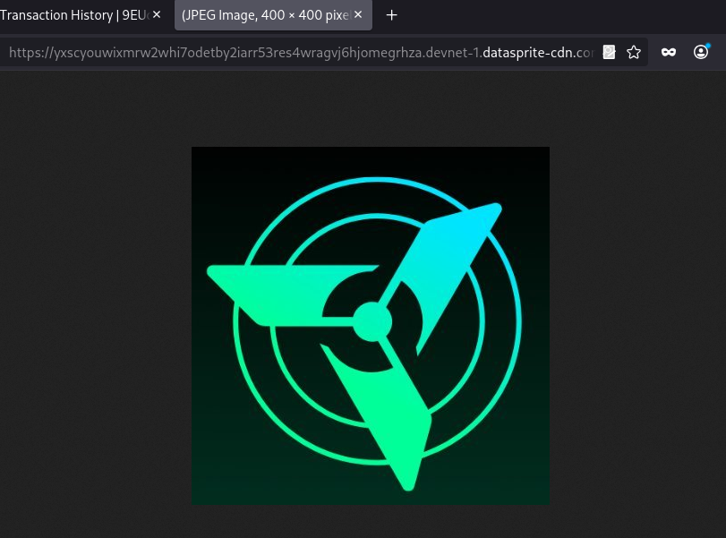
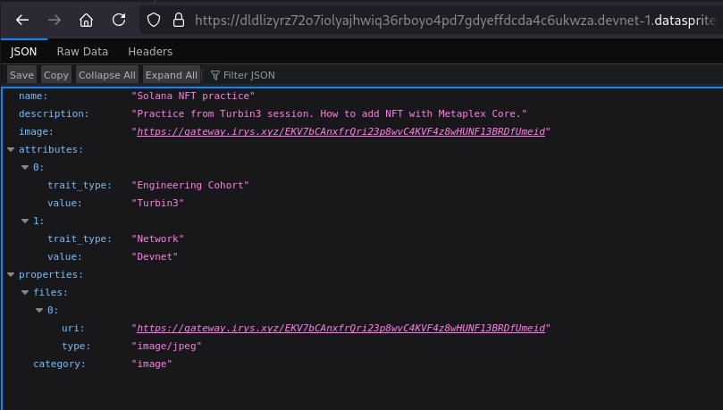
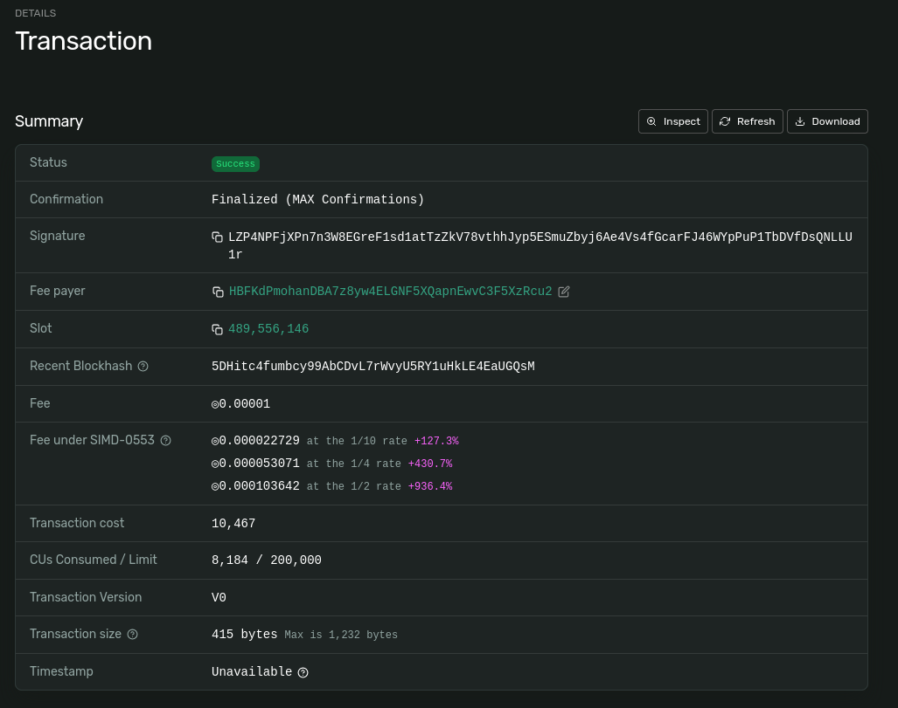
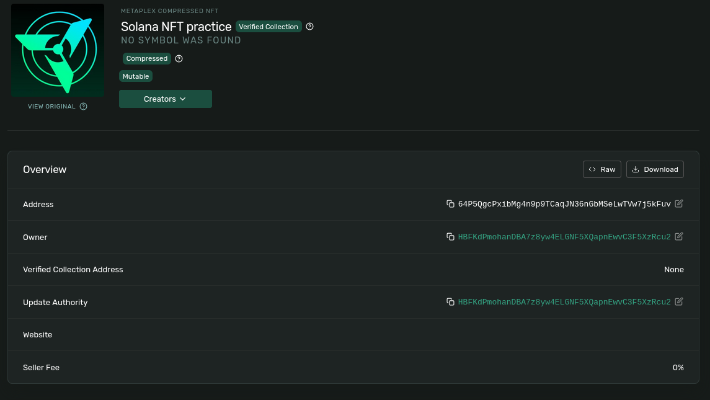

# Solana SPL Token and NFT Practice

## Overview

This repository contains TypeScript scripts for practicing Solana devnet token and NFT operations.

Completed tasks:

- Mint and transfer a custom SPL token.
- Mint an NFT using Metaplex Core.
- Update the NFT name and metadata as the update authority.

Cluster: Devnet

## Wallet

Public address:

```text
HBFKdPmohanDBA7z8yw4ELGNF5XQapnEwvC3F5XzRcu2
```

## 1. SPL Token Mint and Transfer

### 1.1 Create SPL Token Mint

Command:

```bash
npm run spl:init
```

Mint address:

```text
ALs1JR47hDubCQPx3DgdRNshGvhQ8uJ9EEJCg3mF4akB
```

Transaction:

```text
2ou9rhh7yahNx7J3n79KcjKxbJhRJ2T8i7tTwfuNL8oyVUTh1MYJfze3UJtesyvokxX3DUe5Bn83LoziZqtqLbVE
```

#### Explorer:

[Transaction](https://explorer.solana.com/tx/2ou9rhh7yahNx7J3n79KcjKxbJhRJ2T8i7tTwfuNL8oyVUTh1MYJfze3UJtesyvokxX3DUe5Bn83LoziZqtqLbVE?cluster=devnet), [Token](https://explorer.solana.com/address/ALs1JR47hDubCQPx3DgdRNshGvhQ8uJ9EEJCg3mF4akB?cluster=devnet)

#### Screenshots:

1. Transaction:


2. Token:


### 1.2 Mint Tokens

Command:

```bash
npm run spl:mint
```

Associated token account:

```text
E92HzsQ2JGQdDRQHvkWahkL3w2uNcFc72WdSCT25umVz
```

Transaction:

```text
3YbKBQYUEfYQvDKxB4MPnzF3k22N3ajuVvPEmsZTS9a57rxaJ7RuqCykS8akEdZcN4Kp146y9gaEdqorkFMahm9v
```

#### Explorer:

[ATA](https://explorer.solana.com/address/E92HzsQ2JGQdDRQHvkWahkL3w2uNcFc72WdSCT25umVz?cluster=devnet), [Transaction](https://explorer.solana.com/tx/3YbKBQYUEfYQvDKxB4MPnzF3k22N3ajuVvPEmsZTS9a57rxaJ7RuqCykS8akEdZcN4Kp146y9gaEdqorkFMahm9v?cluster=devnet)

#### Screenshots:

1. ATA:


2. Transaction


### 1.3 Transfer Tokens

Command:

```bash
npm run spl:transfer
```

Recipient:

```text
9EUd4VNcjMAysd7zQk3Q1a4tb28BYndLNBAQDiYnHJ64
```

Recipient associated token account:

```text
GXix2FiaFWk2feQ9hnHwYeGfTdKumL4ir7q9McbiPUpD
```

Transaction:

```text
5DAaZSzgg1tEDro49jTjWSjp7cTNwnVmQUcRCtDVvPAykGo2ts7cU3Zu1YHebTkcFNoJUqbS5vSK8Em4qQ8gSytc
```

#### Explorer:
[Transaction](https://explorer.solana.com/tx/5DAaZSzgg1tEDro49jTjWSjp7cTNwnVmQUcRCtDVvPAykGo2ts7cU3Zu1YHebTkcFNoJUqbS5vSK8Em4qQ8gSytc?cluster=devnet), [Receiver](https://explorer.solana.com/address/9EUd4VNcjMAysd7zQk3Q1a4tb28BYndLNBAQDiYnHJ64?cluster=devnet), [ATA Receiver](https://explorer.solana.com/address/GXix2FiaFWk2feQ9hnHwYeGfTdKumL4ir7q9McbiPUpD?cluster=devnet)


#### Screenshots:
1. Token Transfer:


2. Token received:


## 2. MPL Core NFT Mint

[Image URI](https://gateway.irys.xyz/EKV7bCAnxfrQri23p8wvC4KVF4z8wHUNF13BRDfUmeid)



[Metadata URI](https://gateway.irys.xyz/2oXLTuRK36EKRmhZSPJ77MLG1uUbJsdUdgXKXoR1gz5o)



#### Explorer:
[Asset address](https://explorer.solana.com/address/64P5QgcPxibMg4n9p9TCaqJN36nGbMSeLwTVw7j5kFuv?cluster=devnet), [Transaction](https://explorer.solana.com/tx/LZP4NPFjXPn7n3W8EGreF1sd1atTzZkV78vthhJyp5ESmuZbyj6Ae4Vs4fGcarFJ46WYpPuP1TbDVfDsQNLLU1r?cluster=devnet)

#### Screenshots:

1. Transaction:


2. Asset:


## 3. NFT Metadata Update

Old name:

```text
Solana NFT practice
```

New name:

```text
Updated Solana NFT practice
```

Old description:
```text
Practice from Turbin3 session. How to add NFT with Metaplex Core.
```

New description
```text
Updated description and Practice from Turbin3 session. How to update NFT metadata.
```

[Old metadata URI](https://gateway.irys.xyz/2oXLTuRK36EKRmhZSPJ77MLG1uUbJsdUdgXKXoR1gz5o), [New metadata URI](https://gateway.irys.xyz/4Lv6W9ndzazvN3qvRyZAHock8GHsM5FsJ1n22s8NanP6)

#### Explorer:

[Transaction](https://explorer.solana.com/tx/3bv9CxfojNFMCgjz6QX8bqoAHkQNXLMo6ig9Kgco7GaXtaEXBCBkW2ZuRoZoVcV1NvrZrLaT3LehmYkqY9U6CYB3?cluster=devnet), [Asset](https://explorer.solana.com/address/64P5QgcPxibMg4n9p9TCaqJN36nGbMSeLwTVw7j5kFuv?cluster=devnet)


#### Screenshot:


## Tests

Command:

```bash
npx tsc --noEmit
```

Result:

```text
TypeScript check passed with no errors
```

Screenshot:


